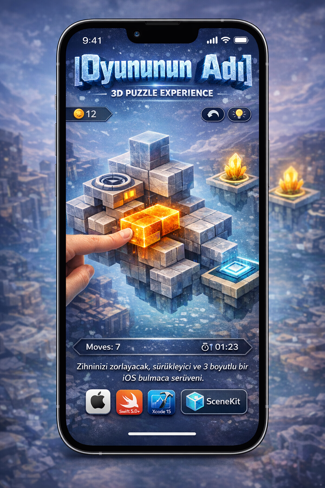

# 🧊 3D Puzzle Experience

<div align="center">
  
  
  
  
</div>

<br>

<div align="center">
  
  
  <p align="center">
    <i>Zihninizi zorlayacak, sürükleyici ve 3 boyutlu bir iOS bulmaca serüveni.</i>
  </p>
</div>

---

## 📖 İçindekiler
- [Oyun Hakkında](#-oyun-hakkında)
- [Öne Çıkan Özellikler](#-öne-çıkan-özellikler)
- [Teknoloji Yığını](#-teknoloji-yığını)
- [Kurulum ve Çalıştırma](#-kurulum-ve-çalıştırma)
- [Nasıl Oynanır?](#-nasıl-oynanır)
- [Yol Haritası (Roadmap)](#-yol-haritası-roadmap)

---

## 🎮 Oyun Hakkında

**[Oyununun Adı]**, uzamsal düşünme ve problem çözme yeteneklerini test eden 3 boyutlu bir bulmaca oyunudur. Oyuncular, karmaşık 3D yapıları çözmek için blokları doğru açılarla hareket ettirmeli ve stratejik hamleler yapmalıdır. 

Mobil cihazların dokunmatik ekran dinamiklerine tamamen uygun olarak tasarlanmış bu oyun, hem görsel bir şölen hem de zihinsel bir antrenman sunar.

## ✨ Öne Çıkan Özellikler

- **Gelişmiş 3D Render:** SceneKit kullanılarak optimize edilmiş akıcı 60 FPS oyun deneyimi.
- **Kademeli Zorluk:** Kolaydan zora doğru ilerleyen, özenle tasarlanmış benzersiz seviyeler.
- **Sezgisel Jest Kontrolleri (Gestures):** Kaydırma, döndürme ve yakınlaştırma hareketleriyle tam 360 derece blok kontrolü.
- **Minimalist UI:** Oyuncunun dikkatini sadece bulmacaya odaklayan temiz ve modern arayüz tasarımı.
- **Geri Al (Undo) Sistemi:** Yanlış hamleleri telafi etmeyi sağlayan hafıza yönetimi.

## 🛠 Teknoloji Yığını

- **Dil:** Swift
- **UI Framework:** SwiftUI / UIKit *(Kendi kullandığını bırak)*
- **3D Motoru:** SceneKit
- **Mimari:** MVVM *(veya MVC, kendi mimarini buraya yaz)*
- **Bağımlılık Yöneticisi:** Swift Package Manager (SPM) / CocoaPods

## 🚀 Kurulum ve Çalıştırma

Projeyi yerel ortamınızda test etmek için aşağıdaki adımları izleyin:

### Gereksinimler
- macOS [Sürüm, örn: Sonoma 14.0+]
- Xcode [Sürüm, örn: 15.0+]
- iOS [Sürüm, örn: 15.0+] hedefli bir cihaz veya simülatör.

### Adımlar

1. **Repoyu Klonlayın:**
   ```bash
   git clone [https://github.com/](https://github.com/)[kullanici-adin]/[repo-adi].git
Proje Dizinine Gidin:


Xcode'da Açın:

Bash
open [ProjeAdi].xcodeproj
Aktif şemanızı seçin (örn: iPhone 15 Pro) ve Run (Cmd + R) butonuna basarak projeyi derleyin.

🕹 Nasıl Oynanır?
Kamerayı döndürmek ve yapıyı farklı açılardan görmek için ekranda tek parmağınızla kaydırın.

Bir bloğu seçmek için üzerine dokunun.

Seçili bloğu uygun boşluklara yerleştirmek için yön oklarını kullanın / sürükleyin.

Tüm bloklar hedef konuma oturduğunda bölüm tamamlanır!

🗺 Yol Haritası (Roadmap)
[x] Temel 3D blok mekaniklerinin entegrasyonu.

[x] Jest (Gesture) kontrollerinin eklenmesi.

[ ] Ses efektleri ve arka plan müziklerinin eklenmesi.

[ ] Game Center entegrasyonu (Liderlik tabloları).

[ ] iCloud ile cihazlar arası kayıt senkronizasyonu.

[ ] Bölüm tasarlayıcı (Level Editor) modunun geliştirilmesi.

🤝 Katkıda Bulunma
Bu proje açık kaynaklıdır ve her türlü katkıya (Pull Request, Issue açma, fikir belirtme) açıktır. Katkıda bulunmak için lütfen bir Issue açarak yapmak istediğiniz değişikliği önceden tartışın.

📄 Lisans
Bu proje MIT Lisansı altında lisanslanmıştır. Daha fazla bilgi için LICENSE dosyasına bakabilirsiniz.

